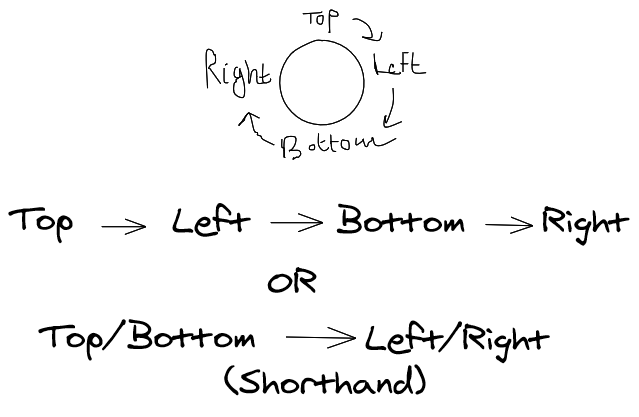
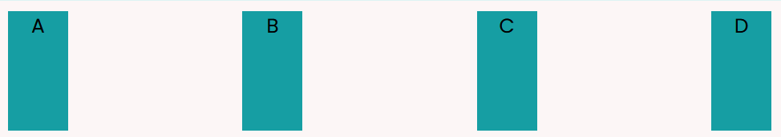
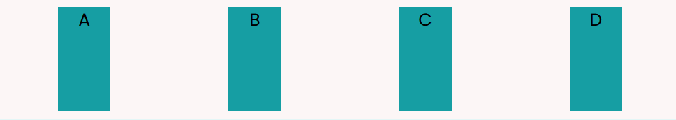
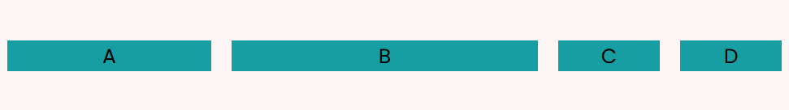
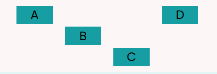

# Notes for css course

[video](https://www.youtube.com/watch?v=1Rs2ND1ryYc)  
content alignment 

## TOC
- [Notes for css course](#notes-for-css-course)
  - [TOC](#toc)
    - [What is a selector](#what-is-a-selector)
    - [Names in css](#names-in-css)
    - [Classes and ids and when to use them](#classes-and-ids-and-when-to-use-them)
    - [Psuedoselectors](#psuedoselectors)
    - [Comments](#comments)
    - [Advanced selectors](#advanced-selectors)
    - [Attribute selectors](#attribute-selectors)
    - [The CSS general rule](#the-css-general-rule)
    - [Types of colors](#types-of-colors)
    - [Coloring text](#coloring-text)
    - [Background colors](#background-colors)
    - [Images/URL's in CSS](#imagesurls-in-css)
    - [Other backgorund properties](#other-backgorund-properties)
    - [Opacity/transparency](#opacitytransparency)
    - [Gradients](#gradients)
    - [Intro to types of units](#intro-to-types-of-units)
    - [Text Mainp](#text-mainp)
    - [Font size, bolding & style](#font-size-bolding--style)
    - [Font Families](#font-families)
    - [Including external fonts with google fonts](#including-external-fonts-with-google-fonts)
    - [Using ext fonts](#using-ext-fonts)
    - [CSS box model](#css-box-model)
    - [Content](#content)
    - [Border](#border)
    - [Padding and margin](#padding-and-margin)
    - [Float & Display types](#float--display-types)
    - [Flexbox (Flexible Box)](#flexbox-flexible-box)
    - [Creating a Flex container](#creating-a-flex-container)
    - [Flex direction and wrap](#flex-direction-and-wrap)
    - [Content Alignment](#content-alignment)
    - [Flex item order](#flex-item-order)
    - [Shrink, Grow & Basis](#shrink-grow--basis)
    - [The 'flex' property](#the-flex-property)
    - [item alignment](#item-alignment)
    - [Grid vs Flexbox](#grid-vs-flexbox)
    - [Transitions](#transitions)
    - [Transformation Functions](#transformation-functions)
    - [Keyframes](#keyframes)
    - [Animation properties](#animation-properties)
    - [Extras from me](#extras-from-me)
    - [Before and after selector](#before-and-after-selector)
    - [Creating two divs side by side (two boxes layot)](#creating-two-divs-side-by-side-two-boxes-layot)
  - [Centering Stuff](#centering-stuff)
    - [Horizontally](#horizontally)
    - [Vertically](#vertically)

### What is a selector
- Selectors connect the html content to your style sheet so that it can be customised

> Note: Try out an very basic selector to test if your stylesheet link is working or not eg. body{ color: red;}  

### Names in css
- Names in css are writen in this format:- my-var

### Classes and ids and when to use them
- classes and ids give flexibility to apply a style to a specfic element in your html
```html
<h1 class="title">HELLO</h1>
<h2 id="subtitle">HI</h2>
```
- They both perform in the same way but their use case is different such that:-  
Classes are used when the same style is going to be used multiple times  
Ids are used when your style is to be applied to a single instance
- Selectors are executed in the following **descending** order:-  
  1. Inline style 
  2. Id selector
  3. class selector
  4. element selector
- inline style is created by 
```html
<h2 style="color: steelblue;">Services</h2>
```
> note: the convention is to write the css styling in their heirarchial order
### Psuedoselectors
- A pseudo-class is used to define a special state of an element.
- For example, it can be used to:
    - Style an element when a user mouses over it
    - Style visited and unvisited links differently
    - Style an element when it gets focus
- *Children Psuedoselectors* give access to well children elements of that element for eg.
```
# using an unordered list
<ul>
    <li>mint</li>
    <li>soda</li>
</ul>
# to access the first li elements of ul 
li:first-child{
    color: blue;
}
# to access every nth child 
li:nth-child(2){
    color: red;
}   
```
- [List of pseudoselectors](https://developer.mozilla.org/en-US/docs/Web/CSS/Pseudo-classes)

### Comments
- Comments in css are made using 
```css
/* Comments here */
```

### Advanced selectors
- To select elements below given element use a plus operator
```css
h2 + a {
    color: red;
}
/* this will turn every a tag under a h2 red */
```
- General sibling selector: Selects every element under that/follows that tag provided they share the same parent
```css
textarea ~ button{
    color: aqua;
}
/* textarea and button are children of the form tag */
```
- the only diff bw these two is that the latter works only when both the tags have the same parent
- **Child selector**: Selects all given children tags of that tag `parent-tag > child-tag`
```html
<ul class="sec-list">
    <li>mint</li>
    <li>choc</li>
</ul>    
```
```css
.sec-list > li{
    color: aqua;
}
/* this will turn every list element under sec-list aqua blue */
```
- Descendence selector: selects every given descendent tag of that tag  
The main diff bw child and descendent is that child selector only works for direct child whereas descendent selector works for every following child of the parent tag (nested tags) `parent-tag child-tag`
```html 
<ul class="sec-list">
    <li>mint</li>
    <li>choc</li>
        <ol>
            <li>crabs</li>
        </ol>    
</ul>
```
```css
/* To color every li tag under sec-list darkblue */
.sec-list li {
    color: darkblue;
}
```

### Attribute selectors
- Attribute selectors select elemets according to their attribute and value of that attribute (duh :( ) `tag[attribute=value]`
- the value can be matched using:-
  * `*` selects all values which contain this  ing
  * `^` selects all values which start with this  ing
  * `$` selects all values which end with this  ing 
```css
img[src*="../img"]{
    border: 10px solid black;
}
/* make a border around every img tag with src containing img */
```

### The CSS general rule
- A property contains two things: The property that dictates what is changing and the value that is changing  
```
 selector{
    property: value;
    property2: value2;
}
```
### Types of colors
- Three type of colors are provided in css color codes, hex, rgb
- color code: named colors
- hex: is base 16 (0->f) 6 digit long code eg.#0000ff 
  - red green blue are represented by 3 groups of 2 digits, `rrggbb`
- rgb: has values that go up to 255 eg. rgb(0,0,255)
> Note: more blue and green mean colder colors and more red means warmer tones
> you can darken a color by dropping the rgb by same proprtion 
> eg. rgb(230,130,50) -> rgb(200,100,20) will darken it
### Coloring text
- use rgb when using the color property
- use darker colors on tags high up in the hierarchy and lighter tones on tags below it eg. red on h1 then orange on h2 

### Background colors
- you use the body selector to change the color of the whole page
- and background property to access the background of that tag
- you should stick to the background tag since it takes all values:- colors, images,...
```css
body{
    background: cyan;
} 
h1{
    background: aqua;
}
```

### Images/URL's in CSS
- you can set an image as an background value
- 2 ways to that:- link to an external link or to an local file
- functions exist in css, url() takes an url for argument and spits image as value
```css
body{
    background: url(example.com/example.jpg)
    background: url(img/cowboy.jpg)
}
```

### Other backgorund properties 
- background-repeat: `repeat`|`no-repeat` default value is repeat, when the size of the container is too big for that image it is going to be repeated like a tile
- background-size: changes the size of the background element,
takes three types of arguments, height and width in pixels or percentage or cover or contain
  - cover value crops/ eches the image to fit the specified size
  - contain preserves the original ratio of the image to and tiles it
```css
background-size: 50px 100px;
background-size: cover;
background-size: contain;
```

### Opacity/transparency
- aplha(a) in rgba dictates the opacity of the color and has value from 0 to 1 `rgba(20,15,60,0.5)`

### Gradients
- gradient is a transition from a color to another
- they can be of 2 types:- linear and radial  
Linear
  - linear can be from top, bottom, left, right, top right, bottom left...
    ```css
    background: linear-gradient(to bottom, rgb(43, 10, 133), rgba(133, 13, 13, 0));
    /* for a nice fade effect */
    ```
   - or can be defined by angle in deg
   ```css
   background: linear-gradient(270deg, rgb(43, 10, 133), rgba(133, 13, 13, 0)); 
   ```
Radial
  - radials dont work with background-size 
  - it accepts color in the order it will show them
  - the colors have to be in increasing order by percentage when percentage is defined
  - you can also define the shape of the radial eg. circle,ellipse
  ```css
  background: radial-gradient(rgb(43, 10, 133) 20%, rgba(133, 13, 13, 0) 80%); 
  ```  

### Intro to types of units
- two types of units:- absolute and relative
- abosulte: units like cm, mm, inches.. that doesnt depend on anything else
- px, pt, pc are some absolute units 
- relative: units that depend on something for eg. `width: 70%` depends on the width of the body of the page, so if the body was 30cm the image would be 21cm
- em is relative unit which scales the object by nth times eg. `font-size:2em` will scale all the font to twice its original size
  - rem is a better alternative to em when there are nested elements involved, rem is relative to the root element unlike em which is relative to the tag above it(this could cause some problems)
- view-port: is the total size of our screen that we are viewing the page on, it is larger than the body tag
- vh and vw: scale the object with ref to the viewport `width: 70vw;` will take 70% of the total viewport
> Note: Use relative units over abs units cuz they work better over in a range of devices

### Text Mainp
- Some font properties are dependent on the choosen font(bold,itaclis,size,...) but some arent (lining,underline,..)
- text-decoration: `none`, `underline`, `line-through` default is underline 
  - none removes the underline from the links
- text-transform: `capitilise`|`uppercase`|`lowercase` transforms the whole text 
- text-align: left|right|center|justify 
  - left right center do what they say
  - justify  eches/squashes the text to fit in the width of the screen
  ```css
  body{
      text-align: justify;
  }
  ```
### Font size, bolding & style   
- font-size: use a relative unit in most cases eg. `font-size:1.25em;`  
- font-weight: defines the boldage of the text normally ranges from 100-800, 100 being very thin and 800 and the boldest
```css
font-weight:800;
```
- font-style: defines italicity of the text italic value gives an italic text
```css
font-style:italic;
```
> Note: `<span>` tag gives an inline container to work with while `<div>` gives a seperate container

### Font Families
- Three main families: Serif, Sans Serif, Monospace
- Serif has line accents to it and looks better on printed media
- Sans Serif is much cleaner and much more used in the digital space
- In Monospace same amount of space is provided to each alphabnumeric character 
```css
font-family:"Arial", sans;
```
Note: multiple fonts can be added as values to font-family so that if one fails the page can fallback on the other

### Including external fonts with google fonts
- don't include too many weights as that will slow down the loading time of the page
- 2 fonts one for heading one for text

### Using ext fonts
- remember to link the font before stylesheet so that the css can use the external fonts
- Use fallback fonts in case of a failure from google fonts

### CSS box model


### Content
- Resizing: You can change the size of the content by using the height and width properties
- **NOTE:** Use an absolute unit on the height property and a relative one on the width 
```css
height: 250px;
width: 70%;
```

### Border
- border: thickness|style|color
```css
border: 12px solid azure;
```

### Padding and margin
- padding is the layer bw the content and the border
- padding is the layer bw border and the rest of the body
- they has 4 dimensions:- top, bottom, left, right
- they accept the thickness of those dimensions in a clockwise order from the top 


### Float & Display types
- Float swithes around the position of the element and also swithes the other elements around it to fit around it.
  - `float:right|left|inheret|none`
  - left & right values switch the element's position towards the left and right of elements above and below it
  - inherit iherets the float value from its parent tag
  ```css
  float: right;
  ```
- Display
  - There are two types of tags, block and inline
  - Block elements have their own box around them while inline elements do not
  - display can change what type the element is 
  - `display:block|inline|none`
  - none makes the element dissapear from the page
    - it is useful in js manip
  ```css
  display: inline-block;
  ```

### Flexbox (Flexible Box)
- Its a way to layout different elements around the page as an alternative to old methods like the boxmodel and float
- Flexbox has 2 main parts: the container and the items
- the container is the parent element in which all he display type is active, typically a div
- Flex items are child elements of the container, and make up the contents of the box

### Creating a Flex container 
- A flex container can be made by setting the display to flex
- Thus a flexbox with the default values is created
```html
<div class="container">
    <div class="container item">A</div>
    <div class="container item">B</div>
    <div class="container item">C</div>
    <div class="container item">D</div>
</div> 
```
```css
.container{
    display: flex;
}
```

### Flex direction and wrap
- Flex direction dictates which way the flex items are going to be displayed
- `flex:row|row-reverse|column|column-reverse`

- `flex-wrap:nowrap|wrap` wraps the items to start at the next line if the screen is too con ained, kinda like text-wrap. Default is nowrap

### Content Alignment
- `justify-content: flex-start|center|flex-end & space-between|space-around`
  - flex-start, center, flex-end **aligns** the item at the start, end and center resp
  - space-between and space-around are a bit special, they too postion the items but they do so by creating gaps bw the items 
    - space-between postions the items wiht equal gaps long the container
      - it is used when the item needs to be  eched along the container  
 
    - space-around does the same thing as space-between but the gapping starts from the start of the container
      - it is used when items should have a centered look       

- `align-items: flex-start|center|flex-end`, the items are brought to their orginal size then using align-items
  - flex-start **postions** the items at the top
  - end does it at the bottom
  - center postions items to the center of the container

### Flex item order
- order: changes the order of the flex item, values[1,no.of items]
  - its much more convinient to use an inline style to change the order of an item since otherwise you would need to create a new class for each item
  - this property comes in handy when we add interactivity to our website, this way we could write a script to change the order of the items by simply changing their `order` property
```html
<div class="container-item" style="order:4;">A</div>
```

### Shrink, Grow & Basis
- flex-basis: sets the minimum size of the item (even if the viewport shrinks or grows)
```html
<div class="container-item" style="flex-basis: 100px;">A</div>
```
- flex-grow: 'grows' the item to take up all the empty space in the container, values[0,n], default is 0 (no growth)
```html
<div class="container-item" style="flex-grow: 1;
        flex-basis: 100px;">A</div>
<div class="container-item" style="flex-grow: 2;
        flex-basis: 100px;">B</div>
```

  - So if the screen size of the page increases the size of the growing element increases **proportionally**
- flex-shrink: sets the rate at which the element shrinks down upon lowering screen size, value[1,n], default is 1 (shrink at same rate as every other element)
```html
<div class="container-item" style="flex-shrink: 3; flex-basis: 40px;">B</div>
```
> NOTE: Use inline styles when using basis shrink and grow so as to avoid making multiple class names for the items

### The 'flex' property 
- `flex: grow|shrink|basis ` is a shorthand property for shrink, grow & basis
- eg. `flex: 5 1 100px;` means the item will grow to take 5 times the space as the other elements, shrink at the same rate as everyother element and will have a minimum size of 100px
- Remember to remove fle
```html
<div class="container-item" style="flex:5 1 100px;">A</div>
<div class="container-item" style="flex:0 3 100px;">B</div>
<div class="container-item" style="flex:0 1 100px;">C</div>
<div class="container-item" style="flex:0 1 100px;">D</div>
```        

### item alignment
- `align-self:flex-start|center|flex-end` works in the same way as align-items but for individual elements 
```html
<div class="container-item" style="align-self: flex-start;">A</div>
<div class="container-item" style="align-self: center;">B</div>
<div class="container-item" style="align-self: flex-end;">C</div>
<div class="container-item" style="align-self: flex-start;">D</div>
```


### Grid vs Flexbox
- Its also a layout system but its more focused on providing tools for both dimensions(width+height), whereas Flexbox is focused on width alone

> I'll go through grid someday later when I'm more interested

### Transitions  
- `transition:property|duration|type of animation|delay` creates an animation b/w changes in the state of the element
- property: State that will be that the transition will be applied to. Suplly specific properties seperated by commas or use the `all` value apply that transition to all states of that property
- duration: sets the duration for the animation
- type of animation:`ease|linear|ease-in-out|` ease gives a smooth transition, linear is a fast a -> b trans, ease-in-out is kinda like ease but more spicier 
- delay: delay b/w start and trans
```css
#transit{
    width: 100px;
    height: 100px;
    background: red;
    transition: width 2s ease;
}
  
#transit:hover {
    width: 300px;
}
```

### Transformation Functions
- `transform`: rotate()|scale() **functions should be seperated by functions**
  - `rotate(<in deg>)`: rotates the element by given degrees
  - `scale(<decimal factor>)`: scales the element by given factor
  - `translate(<x units>,<y units>)`
  - `matrix(<scaleX()>, <skewY()>, <skewX()>, <scaleY()>, translateX(), translateY())`: Shorthand for transform functions
> Remember to do these properties in the class seclector not its state otherwise it would become really clunky
> Try to use individual transform functions instead of matrix() 

### Keyframes
- Advantage over transition: you can define a animation once and use that animaton on many diff elements whereas you have to define a transition for every specific element
- `@keyframes <animation-name>` where animation name can be anything 
- You have atleast define two keyframes a start and an end
- There are two ways to start do animation:-
  1. With from and to
```css
@keyframes red-to-black{
  from {background: red; translate(0px, 0px)}
  to {background: black; translate(10px, 10px)}
}  
```
  2. With percentages
```css
@keyframes red-to-black{
        0% {background: rgb(247, 107, 89); transform: translate(0px, 0px);}    
        25% {background: rgb(255, 123, 0); transform: translate(5px, 5px);}
        50% {background: rgb(255, 187, 0); transform: translate(10px, 10px);}
        75% {background: rgb(231, 210, 16); transform: translate(15px, 15px);}
        100% {background: rgb(231, 243, 121); transform: translate(20px, 20px);}
    }  
```
> Remember to have the keyframes at the end of the page so that its easier to customise

### Animation properties
- `animation-name: <name of the keyframe>`: Links the created keyframe to that element
- `animation-duration:<duration in s/ms>`: Dictates how long the animation will play out for, default is 0 which means the animation wont be played unless changed
- `animation-timing-function`: linear|ease|ease-in-out This the type of the animation style that will be played out, linear is a nice from A->B, ease slows down a bit after each frame of animation, default is ease maybe
- `animation-delay: <in s>` Delay after which the animation will be played. Can have negative values, which will cause that part of that animation to be skipped  
- `animation-iteration-count:<iterations>|infinite`No. of times the animation will be looped over or you can set it to infinite     
- `animation-direction: normal|reverse|alternate|alternate-reverse` 
  - normal: is the default from 0% to 100%
  - reverse: from 100% ro 0%
  - alternate: from 0% to 100% and then 100% to 0% 
  - alternate-reverse: from 100% to 0% and then 0% to 100%
- `animation: name duration timing-function delay iteration-count direction fill-mode play-state`: shorthand for all the animation properties 
  
### Extras from me
- How to put an image in div with CSS?
```html
 <div class="image"></div>
``` 
```css
div.image {
   content:url(http://placehold.it/350x150);
}​
```
- When giving local endpoint to url() go back a directory with `../` if your css file is placed inside a diff dir eg. 
```
#file structure
- index.html
- css
  - style.css
- assets
  - img.png
# then css would be
url(../assets/img.png)
```
- Flex has to properties to move items along x and y axis
  - To align flex items along the cross axis(y) there are three properties: align-content, align-items and align-self.
  - To align flex items along the main axis(x) there is one property: justify-content but no item specific flex property for that
    - With auto margins, flex items can be centered, spaced away or packed into sub-groups. Unlike justify-content, which is applied to the flex container, auto margins go on flex items.
    - They work by consuming all free space in the specified direction.
- [How to justify a single flexbox item (override justify-content)](https://stackoverflow.com/a/33856609/269396) See this for more detailed explanation

### Before and after selector
- The ::before selector inserts something before the content of each selected element(s).
- Use the content property to specify the content to insert.
- Use the ::after selector to insert something after the content.
```html
<html>
<head>
<style>
p::before {
  content: "Read this -";
}
</style>
</head>
<body>

<p>My name is Donald</p>
<p>I live in Ducksburg</p>

</body>
</html>
```

### Creating two divs side by side (two boxes layot)
- You add the two divs into a parent div and set its display property to flex
- Change the display type of the children divs to inline-block
- And the layout is done
```py
parent_div = jp.Div(classes="flex justify-center", a=div)
box1 = jp.Div(classes="border-2 border-gray-200 inline-block", a=parent_div)
box2 = jp.Div(classes="border-2 border-gray-200 inline-block", a=parent_div)
```

## Centering Stuff
### Horizontally 
- Inline stuff can be centered by using text-center property 
- Block level stuff has to be centered by either using flex justify-center or using `margin: 0 auto` (top bottom-0 left right-auto)
### Vertically 
- Use flex then align-items-center in tailwind