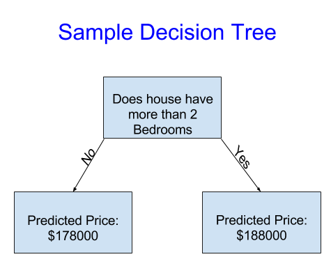
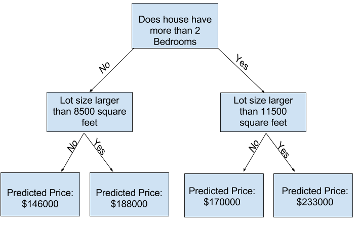
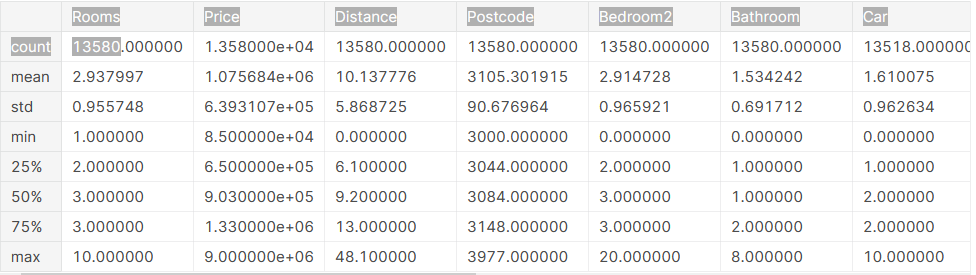
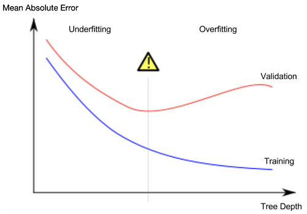

# Machine learning notes for getting into the dsai club

## How model works
> Model: Image result for what is a model in machine learning
A machine learning model is a file that has been trained to recognize certain types of patterns. You train a model over a set of data, providing it an algorithm that it can use to reason over and learn from those data.
- My interpretation: A model recognises patterns, its trained over a data set and has to be given an algorithm `model(recognises patterns) -> 1.data | 2.algo`

## Decision Trees
- A decision tree divides the data into simple groups and then patterns are deduced from within these groups using historical data.
- We start with a decision tree, which acts as a building block for more accurate and high level models



- More **factors** can be caught using more splits in the trees. These are called "deeper" trees
- The point at the bottom where we make a prediction is called a **leaf**.
- Decision Tree -> splits(diff factors) + leaves(predictions based on those factors)



> The process of capturing patterns from data is called **fitting** or **training** the model. The data used to fit the model is called the **training data**. 

## Pandas
- Pandas is used to explore data by data scientists
- A dataframe: Two-dimensional, size-mutable, potentially heterogeneous tabular data.
- To quickly check out the dataframe describe(show stats about the df), head and tail(first 5 and last 5 rows) can be showed.

```py
import pandas as pd

file_path = './path/to/csv'

# Load csv into pandas as a data frame
df = pd.read_csv(file_path)

# Describes the properties of the dataframe
df.describe()
```



- The first number, the count, shows how many rows have non-missing values. Missing values arise for many reasons. For example, the size of the 2nd bedroom wouldn't be collected when surveying a 1 bedroom house.
- The second value is the mean, which is the average. Under that, std is the standard deviation, which measures how numerically spread out the values are.
- To interpret the min, 25%, 50%, 75% and max values, imagine sorting each column from lowest to highest value. The first (smallest) value is the min. If you go a quarter way through the list, you'll find a number that is bigger than 25% of the values and smaller than 75% of the values (`25<x>75`). That is the 25% value (pronounced "25th percentile"). The 50th and 75th percentiles are defined analogously, and the max is the largest number.

## Creating Models
- To choose our features/target, we'll need to see a list of all columns in the dataset. That is done with the columns property of the DataFrame.
```py
df.columns
# Index(['Suburb', 'Address', 'Rooms', 'Type', 'Price', 'Method', 'SellerG',
#        'Date', 'Distance', 'Postcode', 'Bedroom2', 'Bathroom', 'Car',
#        'Landsize', 'BuildingArea', 'YearBuilt', 'CouncilArea', 'Lattitude',
#        'Longtitude', 'Regionname', 'Propertycount'],
#       dtype='object')
```

### Choosing a prediction target
- The column that we want to predict is called our **prediction** target.
- We get can acess the column using `df['column name']` notation. This single column is stored in a Series, which is broadly like a DataFrame with only a single column of data.
- By convention, the prediction target is called y.
```py
y = df['Price']
```

### Choosing features
- The columns that are inputted into our model (and later used to make predictions) are called "features".
- Sometimes, you will use all columns except the target as features. Other times you'll be better off with fewer features.
- We select multiple features by providing a list of column names inside brackets. Each item in that list should be a string (with quotes).
- By convention, the features are called X
```py
melbourne_features = ['Rooms', 'Bathroom', 'Landsize', 'Lattitude', 'Longtitude']
X = df[melbourne_features]
```

## Building the model
- The steps to building and using a model are:
  - Define: What type of model will it be? A decision tree? Some other type of model? Some other parameters of the model type are specified too.
  - Fit: Capture patterns from provided data. This is the heart of modeling.
  - Predict: Just what it sounds like
  - Evaluate: Determine how accurate the model's predictions are.

```py
from sklearn.tree import DecisionTreeRegressor

# Define model. Specify a number for random_state to ensure same results each run
melbourne_model = DecisionTreeRegressor(random_state=1)

# Fit model
melbourne_model.fit(X, y)
```

- Many machine learning models allow some randomness in model training. Specifying a number for `random_state` ensures you get the same results in each run.
- You use any number, and model quality won't depend meaningfully on exactly what value you choose.
- Now we provide some data we want to predict the target for, preferably out-of-sample data but for example's sake:
```py
melbourne_model.predict(X.head())
```

## Model Validation
- In most (though not all) applications, the relevant measure of model quality is predictive accuracy.
- We need a single metric for measuring the accuracy of the model, for basic purposes Mean Absolute Error (MAE) can be used.
```
error1 = |actual1 - prediction1|
MAE = (error1 + error2 + ... errorN)/ N
```
- Validating the model using the data with the data from within the model is called 'in-sample' validation.
- For actual validation of the model we can exclude some data from the model-building process, and then use those to test the model's accuracy on data it hasn't seen before. This data is called **validation data**.

> **Why validation predictions differ from in-sample (or training) predictions?**
Often some factors which actually don't contribute to the real price are also considered by the model in the fitting process. If we validate the model using in-sample data, we will end up with very less MEA leading us to belive that our model is accurate when its actually not, for eg. the price of houses with green doors might be high and this pattern will also be captured in the fitting process but if we validate the data on actual data this is obviously false as door color has no contribution to the final price. Thus its imp to fit the model with out-sample data and validate that way

### Implementing MEA
- The scikit-learn library has a function train_test_split to break up the data into two pieces (diff rows). We'll use some of that data as training data to fit the model, and we'll use the other data as validation data to calculate mean_absolute_error.

```py
from sklearn.model_selection import train_test_split

# split data into training and validation data, for both features and target
# The split is based on a random number generator. Supplying a numeric value to
# the random_state argument guarantees we get the same split every time we
# run this script.
train_X, val_X, train_y, val_y = train_test_split(X, y, random_state = 0) # train_ => training data val_ => validation data
# Define model
melbourne_model = DecisionTreeRegressor()
# Fit model
melbourne_model.fit(train_X, train_y)

# get predicted prices on validation data
val_predictions = melbourne_model.predict(val_X)
print(mean_absolute_error(val_y, val_predictions))
```

## Under and Over fitting
- The decision tree has many options of configuration but the most imp one out of all is the depth(how many splits it takes before coming to a decision) of the tree.

### Overfitting
- if we increase the number of splits the number of splits the number of leaves increases exponentialy, leaves are the end nodes on a branch which actually give a prediction
  - these predictions will be close to the original value of the data with which they were trained with but they make very unreliable predictions for any new data since they are based on so few data points. (performs well in the training data but fails in outsample data)
  - In short they pick up many irrelevant patterns too while training

### Underfitting
- On the opposite side if we use a short depth, we may end with too few categories in the fitting process. 
  - The categories are too broad so even important patterns are not picked up by the model.
  - It performs poorly even with training data let alone out-sample data.

- we want to find the sweet spot between underfitting and overfitting. Visually, we want the low point of the (red) validation curve in the figure below.


- We can control the depth of the tree with the `max_leaf_nodes` argument like so:
```py
model = DecisionTreeRegressor(max_leaf_nodes=<some int>, random_state=0)
```

### Finding the *sweet spot*
- We do this by just looping through many plausible depth sizes and finally keeping the optimal one
```py
def get_mae(max_leaf_nodes, train_X, val_X, train_y, val_y):
  model = DecisionTreeRegressor(max_leaf_nodes=max_leaf_nodes, random_state=0)
  model.fit(train_X, train_y)
  preds_val = model.predict(val_X)
  mae = mean_absolute_error(val_y, preds_val)
  return(mae)

candidate_max_leaf_nodes = [5, 25, 50, 100, 250, 500]

# Looping through the diff node sizes and store them in a dict
mae_dict = {}
for i in candidate_max_leaf_nodes:
  mae_dict[i] = get_mae(i, train_X, val_X, train_y, val_y)

# Store the best value of max_leaf_nodes (it will be either 5, 25, 50, 100, 250 or 500)
for x in mae_dict:
  if mae_dict[x] == min(mea_dict.values()):
    best_tree_size = x
```

- Now that we know a optimised list of features and optimal tree depth we can finalise our model with all the data we have

## Random Forests
- Random forests is another kind of model, it uses many trees and then makes a prediction by **averaging the predictions of each component tree**. It generally has much better predictive accuracy than a single decision tree and it works well with default parameters. 

```py
from sklearn.ensemble import RandomForestRegressor
from sklearn.metrics import mean_absolute_error

forest_model = RandomForestRegressor(random_state=1)
forest_model.fit(train_X, train_y)
melb_pred = forest_model.predict(val_X)
print(mean_absolute_error(val_y, melb_preds))
```

## Classifiers
- A classifier is an algorithm that automatically orders or categorizes data into one or more of a set of **discrete** “classes.” One of the most common examples is an email classifier that scans emails to filter them by class label: Spam or Not Spam.
- Diff b/w classifiers and regressors: regressors predict a continus quantity while classifiers predict discrete class label.
- Just swap the names from regressor to classifier `from sklearn.ensemble import RandomForestClassifier` rest all is same.

## Preprocessing
Do it later

## Formatting predictions to competition format
```py
# Run the code to save predictions in the format used for competition scoring

output = pd.DataFrame({'Id': test_data.Id,
                       'SalePrice': test_preds})
output.to_csv('submission.csv', index=False)
```

# Intermediate Machine Learning
## Handling Missing values
later

## Preprocessing
- we call fit_transform() method on our training data and transform() method on our test data.

### Dropping categorical coloumns

### Ordinal Encoding

### Label Encoding


### One Hot Encoding
X

## Xgboost
- Loss function - A real number representing the loss in the predicted value vs the true value